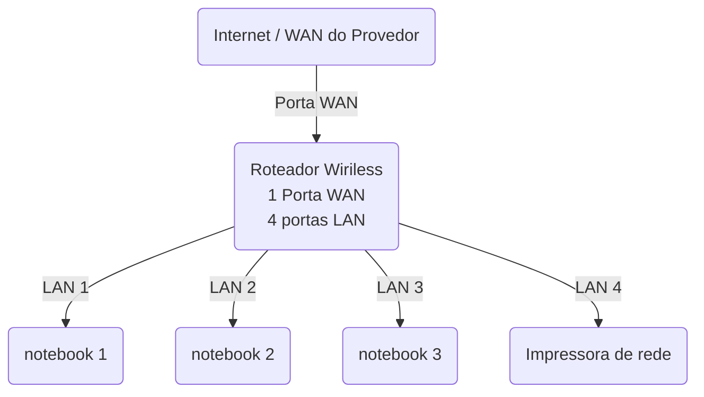
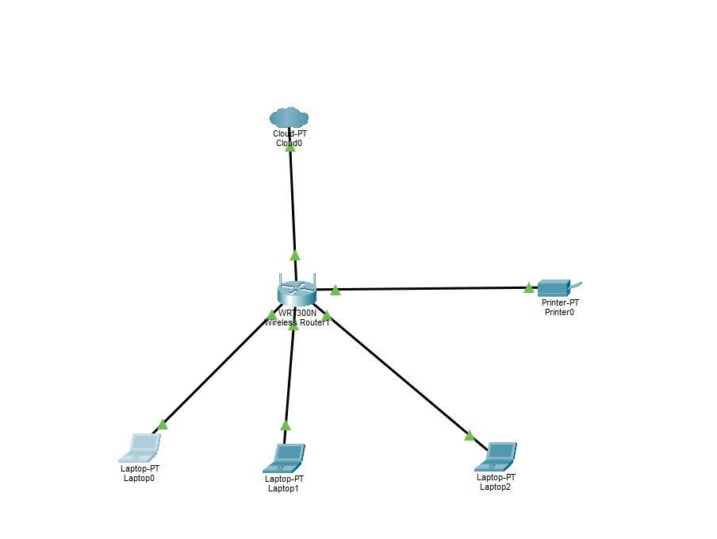

--
# Laboratorio de Redes 01- Projetos de rede local 
Projeto desenvolvido na disciplina de redes de computador do curso Técnico de Informática do Senac. 
--
Aluno: Zahara Flores de Souza  
Professor: José de Assis  
Data:09/03/2026  
--
## 1. Objetivo
implementar uma rede local simples conectando 3 notebooks e um roteador wireless com switch integrado e uma impressora de rede  

O projeto sera realizado em duas etapas:  

1. Simulação da rede no Cisco Packet Tracer
 Implementação de rede no Cisco Packet Tracer
--
 ## 2. Equipamentos utilizados neste laboratório   

  - 3 notebooks
  - 1 Roteador wireles com 1 porta WAN e 4 portas LAN
  - 1 Impressora de rede
  - 4 Cabos de rede

# 3. Topologia da rede
Diagrama lógico de rede utilizados neste laboratório 

--
Imagem da topologia utilizada no laboratório  

--
## 4. Plano de endereçamento IP
Rede:192.168.0.0/24  
Gateway:192.168.0.1  

|Dispositivos | Tipos de IP | Endereço de IP | Observação |
|-------------|-------------|-------------|-------------|
| Roteador | Estatico | 192.168.0.1 | IP do rotedor |
| Impressora | Reserva do DHCP | 192.168.0.100 | IP reservado pelo roteador
| PC1 | Reserva DHCP | 192.168.0l.101 | IP reservado pelo roteador |
| PC2 | DHCP | Automatico | IP reservado pelo roteador
| PC3 | DHCP | Automatico | IP reservado pelo roteador    

**Observação**

- A impressora e um dos notebooks utilizam reservas DHCP.
- O roteador sempre atribui o mesmo endereço IP a esses dispositivos

   --

  ## 5. Implementação no laboratório real

   Após a intalação, a rede foi montada fisícamente no laboratório
  
  Etapas realizadas:

  (fotos- capturas de tela realizadas durante o laboratório)

  Testes:

  (fotos- capturas de tela realizadas durante o laboratório)

  -----

  ## Conclusão

Este laboratório permitiu compreender o funcionamento de uma rede local simples, incluindo:

-Estrutura de uma rede domestica ou de pequenos escritorios   
-Utilização de um roteador com a porta WAN e portas LAN  
-Comunicação entre dispositivos na rede local   
-Utilização de uma impressora de rede 
-Compartilhamentos de pasta de redes  
