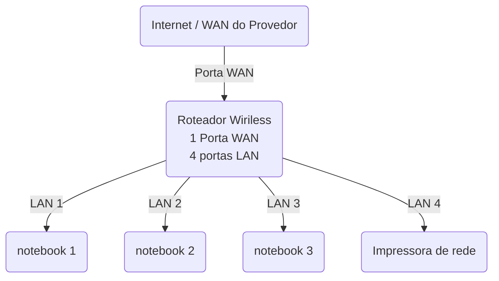

--
# Laboratorio de Redes 01- Projetos de rede local 
Projeto desenvolvido na disciplina de redes de computador do curso Técnico de Informática do Senac. 
--
Aluno: Zahara Flores de Souza  
Professor: José de Assis  
Data:09/03/2026  
--
## 1. Objetivo
implementar uma rede local simples conectando 3 notebooks e um roteador wireless com switch integrado e uma impressora de rede  

O projeto sera realizado em duas etapas:  

1. Simulação da rede no Cisco Packet Tracer
 Implementação de rede no Cisco Packet Tracer
--
 ## 2. Equipamentos utilizados neste laboratório   

  - 3 notebooks
  - 1 Roteador wireles com 1 porta WAN e 4 portas LAN
  - 1 Impressora de rede
  - 4 Cabos de rede

# 3. Topologia da rede
Diagrama lógico de rede utilizados neste laboratório 

    
